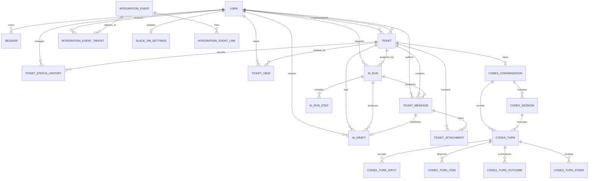
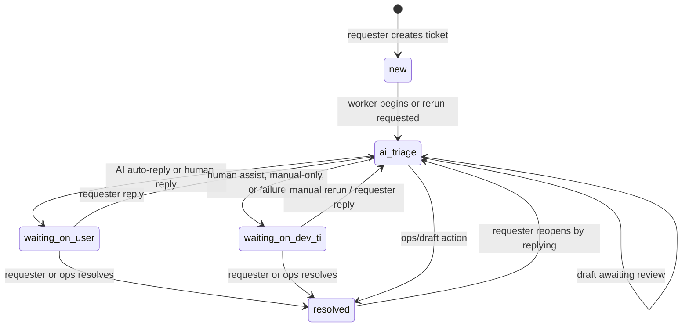
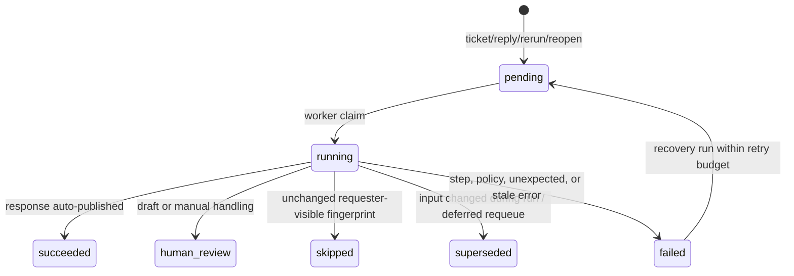
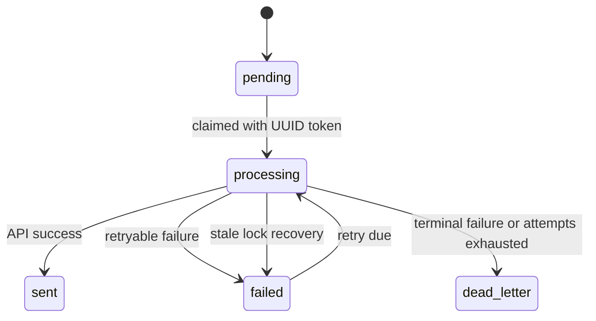

# Data and state model

## 1. Persistence strategy

AutoSac has two coordinated durable stores:

- **PostgreSQL** is authoritative for business state, authentication, queue state, structured AI results, integration outbox state, and operational health.
- **Persistent filesystem** is authoritative for attachment bytes and AI execution artifacts. PostgreSQL stores paths and attachment metadata, but not file bytes.

Superloop has a separate filesystem/Git persistence model and does not use AutoSac tables.

## 2. Relational entity map



`PreauthLoginSession` and `SystemState` are standalone operational entities. `IntegrationEvent.aggregate_id` and `IntegrationEventLink.entity_id` are intentionally polymorphic UUIDs and therefore are not database foreign keys to ticket/message/history tables.

## 3. Entity catalog

| Entity / table | Purpose and important fields | Relationships and invariants |
| --- | --- | --- |
| `User` / `users` | Email, display name, password hash, role, active flag, optional unique Slack user ID | Role is requester/dev_ti/admin; referenced by sessions, tickets, messages, history, views, runs, drafts, Slack targets/settings |
| `SessionRecord` / `sessions` | Hash of opaque auth cookie, CSRF token, remember flag, expiry, last seen, client metadata | FK to user; raw session token is never stored |
| `PreauthLoginSession` / `preauth_login_sessions` | Hash of short-lived login-form cookie, CSRF token, sanitized next path, expiry | Ten-minute challenge; separate from authenticated session |
| `Ticket` / `tickets` | Stable `T-000001` reference, title, owner/assignee, status, urgency, route target, AI summary fields, requeue metadata, timestamps | One active pending/running AI run enforced indirectly by partial unique index on `ai_runs`; sequence-backed reference number |
| `TicketMessage` / `ticket_messages` | Markdown/text body, author type, visibility, source, optional author and AI run | Public/internal visibility; source identifies requester, human, AI draft/auto, or system origin |
| `TicketAttachment` / `ticket_attachments` | Original name, stored path, MIME type, hash, bytes, optional dimensions, visibility | FK to ticket and owning message; file bytes remain on disk |
| `TicketStatusHistory` / `ticket_status_history` | From/to state, actor, optional note, time | Append-oriented audit; each real change can emit a Slack integration event |
| `TicketView` / `ticket_views` | Last-viewed timestamp | Composite PK `(user_id, ticket_id)` supports unread calculations |
| `AIRun` / `ai_runs` | Queue status/trigger, input hash, model/pipeline, forced routing, final structured output, artifact paths, worker ownership/heartbeat/recovery | FK to ticket/requesting user; partial unique active-run index; final step ID is stored but not declared as an FK |
| `AIRunStep` / `ai_run_steps` | Ordered router/selector/specialist execution, spec/version/contract/model, paths, output JSON, error and timing | FK to AI run; unique `(ai_run_id, step_index)` |
| `CodexConversation` / `codex_conversations` | One logical persistent Codex conversation per ticket, including active/recovery/unavailable/closed state | FK to ticket; at most one row per ticket |
| `CodexSession` / `codex_sessions` | Native Codex thread segment, stored `thread_id`, status, lease owner/worker/expiry, start/end timestamps | FK to conversation; one active session is leased by at most one run |
| `CodexTurn` / `codex_turns` | Persistent specialist turn metadata, transport kind (`exec` or `app_server`), native turn ID, output contract, artifact paths, acceptance/completion/fence times, effective input hash | FK to conversation/session/run; unique run, monotonic conversation turn index, one active turn per conversation, unique native turn per session when present |
| `CodexTurnInput` / `codex_turn_inputs` | Ordered input events accepted into a persistent turn, including event/source identity, dedupe key and canonical payload | FK to turn; unique turn/input index and turn/dedupe key; rows are written only after native turn acceptance |
| `CodexTurnItem` / `codex_turn_items` | Ops-internal native protocol/JSONL items observed during persistent execution, including bounded app-server protocol artifacts and late retired-session output marked non-publishable | FK to turn; ordered by item index |
| `CodexTurnOutcome` / `codex_turn_outcomes` | Append-only attempted/accepted/completed/publication/failure outcomes for a persistent turn, including transport lifecycle, recovery, completion-race, supersession, and steering disposition payloads | FK to turn; ordered by outcome index |
| `CodexTurnSteer` / `codex_turn_steers` | Delivery receipts for active-turn steering attempts, including source/dedupe identity, expected native turn, RPC correlation, payload hash, delivery status and errors | FK to turn; unique turn/dedupe key |
| `AIDraft` / `ai_drafts` | Pending requester-facing response and review/publish state | FK to ticket/run/reviewer/published message; only one current pending draft is maintained by superseding older drafts |
| `IntegrationEvent` / `integration_events` | Immutable event snapshot, unique dedupe key, aggregate, routing/suppression result | Parent of event links and delivery targets |
| `IntegrationEventLink` / `integration_event_links` | Polymorphic link to ticket/message/status-history entity | Unique event/entity/relation combination |
| `IntegrationEventTarget` / `integration_event_targets` | Recipient, reason, pending/processing/retry/terminal delivery state, claim ownership | FK to event and recipient user; unique `(event_id, target_name)`; terminal timestamps constrained to status |
| `SlackDMSettings` / `slack_dm_settings` | Singleton enablement, encrypted bot token, Slack identity, event flags and delivery tuning | PK must be `default`; updater FK to user; validation mirrored in code and DB constraints |
| `SystemState` / `system_state` | JSON operational snapshots | Keys include bootstrap version, worker heartbeat, Slack delivery health, and Slack user-sync state |

## 4. Ticket aggregate

`Ticket` is the aggregate root. `shared.ticketing` updates the ticket, creates messages/history/views/drafts/runs, and emits integration events in the same SQLAlchemy transaction.

### Ticket status model



Operations users can explicitly set any declared ticket status except that selecting `ai_triage` is implemented as a manual AI rerun. The diagram shows normal product flows, not every admin-forced transition.

Status mutation always writes `TicketStatusHistory` when the state actually changes. `resolved_at` is set only in `resolved` and cleared for other states.

### Visibility

- Requesters see public messages and public attachments for tickets they own.
- Dev/TI and admins can see all tickets, public and internal lanes, AI steps and drafts.
- Worker prompts include both public and internal messages, but include an explicit `requester_can_view_internal_messages` flag and shared non-disclosure policy.
- Only public attachments are loaded into the worker context.

## 5. AI run state



Important invariants:

- Only one `pending`/`running` row per ticket is allowed.
- If new work arrives while a run is active, the ticket stores a deferred requeue request rather than creating a second active row.
- The worker fingerprints requester-visible input before execution and again before publication. A changed fingerprint or requeue flag supersedes the result, preventing stale publication.
- Every material step/finalization update locks the run and checks its `worker_instance_id`.
- Heartbeats permit stale-run recovery. A replacement records its predecessor and increments `recovery_attempt_count`.
- Exhausted recovery adds an internal system note and routes the ticket to `waiting_on_dev_ti`.
- Persistent specialist turns also hold a Codex session lease for the run duration. Accepted initial content is recorded in `CodexTurnInput` only after the native turn is accepted. `CodexTurn.effective_input_hash` tracks the full accepted ticket snapshot (while `CodexTurnInput` retains the exact delta delivered by that turn), so completion and publication compare the same hash domain on both initial and resumed conversations. Active-turn steering adds `CodexTurnSteer` custody records: accepted receipts are consumed input, rejected receipts remain future context, and ambiguous receipts force recovery and block publication.

## 6. AI output and draft state

Structured final outputs use one of these contracts:

- `router_result`: route target ID and rationale;
- `specialist_selector_result`: specialist ID and rationale;
- `specialist_result`: language, public/internal content, confidence, risk, summary, and publication recommendation;
- `human_handoff_result`: route/handoff reason, internal note, optional public reply and assistant metadata;
- `triage_result`: legacy read/backfill model only.

Draft state progresses from `pending_approval` to `published` or `rejected`. A newly created draft supersedes older pending drafts for the ticket. Historical values `approved` and `superseded` remain in the model vocabulary; current publish logic moves directly to `published` and records reviewer/time/published message.

## 7. Integration outbox state

Ticket mutations can record three event types:

- `ticket.created`;
- `ticket.public_message_added` (excluding the initial create message);
- `ticket.status_changed` (excluding initial/no-op state).

An event is always persisted even when delivery is disabled, invalid, notification-specific disabled, or has no eligible recipients. Its `routing_result` captures that decision. Only a `created` routing decision creates one target per eligible requester/assignee. The actor causing a public message or status change is excluded from recipients.

Target state is:



Retries use exponential delay capped at 30 minutes. Stale processing locks are recovered using configured timeout. Finalization requires the claim token, preventing a stale worker from overwriting a newer claim.

## 8. Filesystem data model

```text
TRIAGE_WORKSPACE_DIR/
  AGENTS.md
  .agents/skills/<skill-id>/SKILL.md
  app/                         # configured repository evidence mount
  manuals/                     # configured manuals evidence mount
  attachments_store/
    <ticket-uuid>/
      <attachment-uuid>.<ext>
  runs/
    <ticket-uuid>/
      <run-uuid>/
        run_manifest.json
        attachments/           # copies materialized for this run
        01-<agent-spec-id>/
          prompt.txt
          schema.json
          final.json
          stdout.jsonl
          stderr.txt
          step_manifest.json
        02-<agent-spec-id>/...
        03-<agent-spec-id>/...
```

The Codex process runs with `TRIAGE_WORKSPACE_DIR` as its current directory. Uploaded files are copied into the run directory using a sanitized filename that contains the attachment UUID. Images are additionally passed through Codex CLI `--image` flags.

## 9. Superloop filesystem state

Current source code uses this conceptual layout:

```text
<target-repo>/.superloop/tasks/<task-id>/
  task.json
  decisions.txt
  raw_phase_log.md
  plan/
    criteria.md
    feedback.md
    plan.md
    phase_plan.yaml
  implement/phases/<phase-key>/
    criteria.md
    feedback.md
    implementation_notes.md
  test/phases/<phase-key>/
    criteria.md
    feedback.md
    test_strategy.md
  runs/<run-id>/
    request.md
    raw_phase_log.md
    events.jsonl
    sessions/
      plan.json
      phases/<phase-key>.json
```

`decisions.txt` is a task-scoped append-oriented ledger with runtime-created headers. `events.jsonl` is the machine-readable run lifecycle and is used to reconstruct resume checkpoints. Plan state is task-global; implementation/test artifacts and persistent Codex sessions are phase-local. Git commits provide additional checkpoints when Git mode is enabled.
