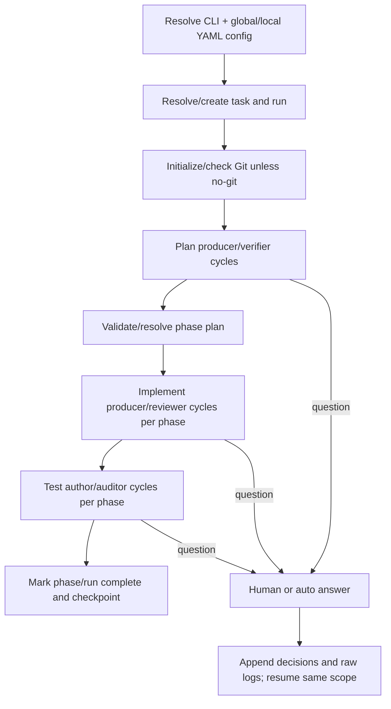

# Runtime flows and relationships

## 1. Authentication and authorization

### Login

1. `GET /login` sanitizes the optional relative `next` path.
2. The server deletes any previous preauth challenge, creates a ten-minute `PreauthLoginSession`, and returns a form containing its CSRF token plus an HTTP-only cookie containing the raw opaque token.
3. `POST /login` hashes the cookie token, loads the unexpired challenge, constant-time compares the CSRF value, and verifies the active user/password.
4. Passwords are normally Argon2 hashes; a PBKDF2 format is supported for compatibility.
5. The server creates a `SessionRecord`, stores only a SHA-256 token hash, sets an HTTP-only SameSite=Lax cookie, invalidates the preauth record, and redirects to the sanitized destination or role home.

Cookie `Secure` is enabled when `APP_BASE_URL` uses HTTPS. Normal sessions last configured hours; remembered sessions receive a persistent max-age and configured day lifetime. Each valid lookup refreshes `last_seen_at` but does not extend `expires_at`.

### Request authorization

FastAPI dependencies enforce authentication and roles. Requester endpoints permit requester, Dev/TI, and admin roles, but requester ticket lookup still scopes non-ops users to their owner ID. Ops endpoints require Dev/TI/admin; user/Slack administration applies additional admin or self-edit rules. Mutating forms validate the session CSRF token.

Unauthenticated top-level browser navigations under `/app` or `/ops` receive a 303 login redirect with a sanitized local `next`. Non-navigation or HTMX unauthorized requests retain HTTP 401 semantics. Authenticated wrong-role requests receive 403.

## 2. Ticket creation and file persistence

```mermaid
sequenceDiagram
    actor R as Requester
    participant W as FastAPI route
    participant D as shared.ticketing
    participant DB as PostgreSQL
    participant FS as Attachment store

    R->>W: POST title, description, urgent, files, CSRF
    W->>W: Parse limits; read bytes; hash; probe image dimensions
    W->>D: create_requester_ticket(...)
    D->>DB: Reserve sequence; insert ticket + initial message
    D->>DB: Insert attachment metadata + pending AIRun
    D->>DB: Insert initial status/view + integration event/targets
    W->>FS: Persist validated attachment bytes
    W->>DB: Commit
    W-->>R: 303 ticket detail
```

The route layer coordinates database commit and filesystem writes and removes created paths if the operation fails. Files are size/count limited; any file type is accepted. Pillow recognition only determines whether width/height and Codex image flags are available.

## 3. Requester and operations mutations

- A requester reply adds a public message, changes/reopens the ticket to `ai_triage`, creates a run or sets deferred requeue, updates the requester view, and emits a public-message event.
- Requester resolve writes status history and updates the view.
- An ops public reply can set waiting/resolved state or request AI triage; internal notes never emit public Slack events.
- Assignment changes the assignee and view time but does not emit a dedicated integration event.
- Ops status changes write history and event records.
- Manual reruns may force a route target and specialist. If a run is active, those overrides are stored on the ticket's deferred requeue fields.
- Draft approval creates a public AI-authored message, marks the draft published, records the human reviewer, updates status/view, and emits an event. Rejection changes only draft/reviewer and ticket/view timestamps.

All of these are service-layer operations in `shared.ticketing`; route handlers own form parsing, permissions, error presentation, commit, and file cleanup.

## 4. AI queue claim and recovery

The worker's main loop performs:

1. Sweep up to 20 stale `running` runs whose heartbeat/start/create reference predates the configured threshold.
2. Mark stale runs and running steps failed.
3. If retry budget remains, create a replacement pending run, carrying trigger/requester/forced routing and recovery lineage. If exhausted, add a failure note and route to Dev/TI.
4. Claim the oldest pending row with `FOR UPDATE SKIP LOCKED` and stamp PID, instance ID, start, and heartbeat.
5. Process the claimed ID outside the claim transaction.
6. Sleep for `WORKER_POLL_SECONDS`.

A heartbeat thread independently writes `system_state.worker_heartbeat` and updates the active run only when its owner instance matches.

## 5. AI triage pipeline

```mermaid
sequenceDiagram
    participant M as Worker main
    participant T as worker.triage
    participant P as worker.pipeline
    participant S as worker.step_runner
    participant C as Codex CLI
    participant DB as PostgreSQL
    participant FS as Run artifacts

    M->>T: process_ai_run(run_id, worker_instance_id)
    T->>DB: Lock owned run; load ticket context; fingerprint
    alt unchanged non-manual input
      T->>DB: Mark skipped; process deferred requeue
    else new input
      T->>P: execute_triage_pipeline
      P->>S: router step
      S->>FS: prompt + schema + manifests
      S->>DB: Insert running AIRunStep
      S->>C: codex exec, read-only, no approval/search
      C-->>S: JSONL + schema-constrained final JSON
      S->>S: Pydantic + registry semantic validation
      S->>DB: Complete step with output JSON
      opt automatic selection
        P->>S: selector step
      end
      opt selected specialist
        P->>S: specialist step
      end
      P-->>T: PipelineExecutionResult
      T->>DB: Re-lock run; reload context; compare fingerprint/requeue
      alt stale input
        T->>DB: Mark superseded; enqueue deferred run
      else current input
        T->>DB: Apply route, note/reply/draft/status, final run output
      end
      T->>FS: Final run manifest snapshot
    end
```

### Step preparation and execution

The step runner:

- creates `runs/<ticket>/<run>/<index>-<spec>/`;
- copies existing public attachments into the run and records absolute/workspace-relative paths;
- renders the versioned prompt with public/internal messages, requester role and visibility, route catalog/selection context, shared policy and attachments;
- generates the Pydantic JSON schema for the output contract;
- launches Codex with `--ask-for-approval never`, `exec --ephemeral`, `--sandbox read-only`, JSON output, output schema, final-message file, web search disabled, and optional model/images;
- writes stdout/stderr even on failure or timeout;
- validates JSON shape and registry-dependent choices;
- persists step result to PostgreSQL and manifests.

Codex is allowed to read only the bootstrapped workspace. The workspace contract forbids edits, live DB/log access, web search, promises of fixes, and public disclosure of internal messages.

### Routing variants

- **Fixed target**: router step 1, configured specialist step 2.
- **Automatic human assist**: router step 1, selector step 2, selected specialist step 3.
- **No specialist**: the route target can yield a synthesized human handoff from the router result.
- **Forced rerun**: a synthetic router step records the ops choice, followed by the forced specialist at step 2.

### Publication outcomes

For `direct_ai`, policy can allow:

- `auto_publish`: public reply, normally `waiting_on_user`, run `succeeded`;
- `draft_for_human`: pending draft/internal note, run `human_review`;
- `manual_only`: internal note and human handling, run `human_review`.

For `human_assist`, publication is always human-reviewed; any public content becomes a draft and the ticket moves to the configured human queue. Internal requesters (`dev_ti`/`admin`) have a deliberate override: a valid specialist result with usable content is normalized to an auto-published response because they can view technical/internal detail.

Failures write an internal system note, mark the run failed, route to `waiting_on_dev_ti`, and then process any deferred requeue.

## 6. Slack event emission and delivery

```mermaid
sequenceDiagram
    participant TX as Ticket transaction
    participant E as shared.integrations
    participant DB as PostgreSQL outbox
    participant DW as Slack delivery thread
    participant API as Slack Web API

    TX->>E: ticket created/public message/status changed
    E->>E: Evaluate DB-backed config and recipients
    E->>DB: Insert deduplicated event + links
    alt enabled, valid, event flag on, recipients eligible
      E->>DB: Insert pending target per recipient
    else suppressed
      E->>DB: Store suppression reason, no targets
    end
    TX->>DB: Commit domain + outbox atomically

    loop each worker cycle
      DW->>DB: Reload Slack settings; auth preflight
      DW->>DB: Claim due targets with SKIP LOCKED + claim token
      DW->>API: conversations.open
      DW->>API: chat.postMessage
      DW->>DB: Finalize sent/failed/dead_letter if claim token matches
      DW->>DB: Recover stale processing locks
    end
```

The event payload is a snapshot, so delivery does not need to reconstruct historical ticket state. Message events include a bounded whitespace-normalized preview. Recipient resolution includes active requester and assignee users with Slack IDs, coalesces the same person, and excludes the actor for message/status events.

Slack bot tokens are encrypted with Fernet using a key derived from `APP_SECRET_KEY` through HKDF. The worker revalidates configuration and token usability. `auth.test` is used for health/config classification; `conversations.open` and `chat.postMessage` perform delivery. Retryable versus terminal API/HTTP/recipient errors determine `failed` versus `dead_letter`.

### Slack user synchronization

Saving a token or starting a worker with a stored token requests synchronization in `SystemState`. The sync thread:

1. locks/consumes the pending request;
2. loads active AutoSac users without Slack IDs;
3. resolves/decrypts the current bot token;
4. pages through `users.list`;
5. matches normalized email exactly;
6. applies only unambiguous, uniqueness-safe IDs;
7. stores a health/result snapshot.

Missing `users:read` or `users:read.email`, duplicate Slack emails/IDs, transport errors, and invalid token/config states are reported without guessing mappings.

## 7. Web readiness and health

- `/healthz` is process liveness only.
- `/readyz` validates settings, PostgreSQL, workspace mounts/exact contracts/skills, routing registry, and AI-run history completeness.
- Startup scripts run equivalent checks. Worker normal startup can create missing contract files; web startup tolerates a missing workspace skill with a warning, but `/readyz` remains strict.

## 8. Superloop execution flow



Each cycle runs a producer and then a verifier in a persistent Codex thread. Producer promises do not control completion; verifier `COMPLETE` is accepted only when criteria contain no unchecked boxes. `INCOMPLETE` loops with feedback; `BLOCKED` terminates the pair/run. Malformed control output gets one corrective retry.

Plan uses a task-global session and artifacts. Implement and test share one persistent session per phase and use phase-local artifacts. The event stream records cycles, pair/phase transitions, questions, completion and terminal state. Resume reconstructs counters and completed scope from this stream and refuses terminal runs. By default, Superloop snapshots and commits scoped changes before/after significant phases and detects verifier edits outside its allowed artifact paths.
