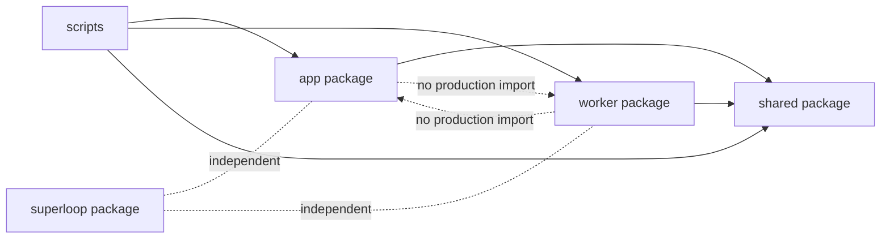
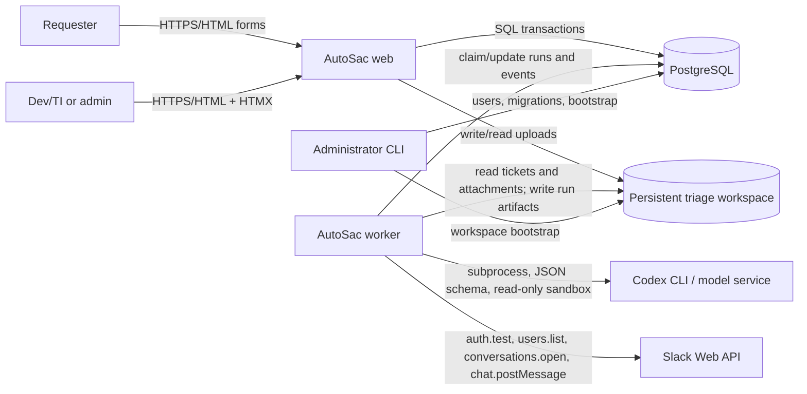
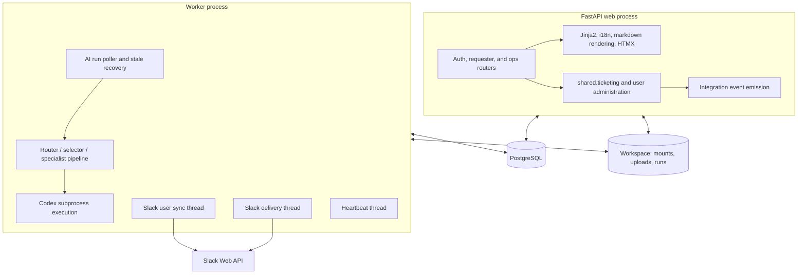
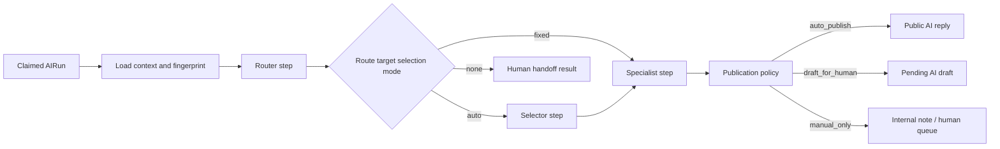

# System overview

## 1. Purpose and scope

The primary AutoSac product is an internal service desk and AI-assisted triage system with three roles:

- `requester`: creates tickets, reads the public thread, replies, downloads public attachments, and resolves owned tickets.
- `dev_ti`: performs operations work across all tickets, including assignment, public replies, internal notes, status changes, AI reruns, and draft review.
- `admin`: has operations access plus user administration and Slack integration configuration.

The AI is advisory and response-generating, not an implementation agent. Its workspace contract is explicitly read-only. Depending on routing and policy, it can auto-publish low-risk responses, create drafts for an operator, add internal notes, or hand the ticket to humans.

## 2. Architectural style

AutoSac is a modular monolith with process separation:

- The **web process** owns HTTP interaction and synchronous domain transactions.
- The **worker process** owns asynchronous AI work, run recovery, Slack directory sync, and Slack delivery.
- The **shared package** contains the persistence model, domain services, security, configuration, routing registry, workspace contract, and integrations used by both processes.
- PostgreSQL coordinates the processes and provides durable queues. There is no Redis, Celery, Kafka, or separate message broker.
- A shared persistent workspace contains attachments and AI audit artifacts.

The dependency direction is intentionally simple:

The only app/worker coupling is through shared database rows and filesystem contracts, not Python calls.

## 3. System context

## 4. Runtime containers

### Web process

Entry point: `scripts/run_web.py`, which validates configuration, database connectivity, workspace contracts, and historical AI-run shape before launching `uvicorn` against `app.main:app`.

`app.main` mounts local static assets, registers three routers, logs every HTTP request as structured JSON, exposes liveness/readiness endpoints, and converts unauthenticated browser navigations into safe login redirects.

The UI is server-rendered. Jinja templates receive localized labels and formatting helpers. HTMX is vendored locally and is used for operations list/board fragment refreshes. Markdown is rendered with raw HTML disabled and then sanitized by Bleach.

### Worker process

Entry point: `scripts/run_worker.py`, which performs startup checks and starts `worker.main`.

The main thread polls and processes one AI run at a time. Three daemon threads operate alongside it:

- heartbeat: updates global worker state and the active run heartbeat;
- Slack user sync: processes requested exact-email directory synchronization;
- Slack delivery: claims and sends queued DM targets.

Multiple worker processes are technically coordinated by row locks and ownership fields, although one process is the documented deployment shape. Each process handles at most one AI run concurrently; Slack work is independently batched in its delivery thread.

### PostgreSQL

PostgreSQL is both the transactional system of record and queueing mechanism. Important coordination constructs are:

- a partial unique index allowing only one `pending` or `running` AI run per ticket;
- `SELECT ... FOR UPDATE SKIP LOCKED` for AI-run and Slack-target claims;
- worker instance IDs and claim tokens for ownership-safe finalization;
- unique dedupe keys for integration events;
- JSONB for structured AI outputs, event payloads, and system-state snapshots.

The application is not database-portable without changes because its models and migrations use PostgreSQL UUID, JSONB, sequences, partial indexes, and PostgreSQL-specific ordering/index expressions.

### Filesystem workspace

The configured triage workspace has three roles:

1. **Read-only evidence workspace**: `app/` and `manuals/` mounts are exposed to Codex.
2. **Attachment store**: uploaded files live under `attachments_store/<ticket-id>/<attachment-id>.<ext>` and metadata lives in PostgreSQL.
3. **Run audit store**: `runs/<ticket-id>/<run-id>/` contains a run manifest, copied public attachments, and step folders containing prompt, JSON schema, final JSON, stdout JSONL, stderr, and a step manifest.

Bootstrap copies each versioned agent skill into `.agents/skills/<skill-id>/SKILL.md`, writes the workspace `AGENTS.md` contract, validates mounts, and initializes a Git repository when needed.

## 5. External dependencies

| Dependency | Purpose | Interaction |
| --- | --- | --- |
| PostgreSQL | Primary data store and queues | SQLAlchemy + psycopg; Alembic migrations |
| Codex CLI | Structured ticket analysis | Local subprocess, stdin prompt, JSONL stdout, schema-constrained final file |
| Model service | Model inference behind Codex CLI | Authentication through CLI login or `CODEX_API_KEY` |
| Slack Web API | DM notifications and user-ID synchronization | `auth.test`, `users.list`, `conversations.open`, `chat.postMessage` over `httpx` |
| Persistent disk | Uploads, workspace contract, run artifacts | Direct filesystem access by web and worker |
| Browser | User interface | HTML forms, cookies, static CSS/HTMX, Jinja-rendered pages |

## 6. AI routing architecture

The AI pipeline is data-driven by `agent_specs/registry.json` and the manifest/prompt/skill triplets under `agent_specs/<id>/`.

Current enabled direct-AI targets are support, access/configuration, data operations, bug, feature, business analyst, software architect, and software/data engineer. `manual_review` is an enabled human-assist target with automatic specialist selection. `unknown` is retained disabled for historical compatibility. The software/data-engineer specialist is restricted to `dev_ti` and `admin` requesters.

Publication is a separate policy decision after model output validation. An `auto_publish` recommendation is accepted only when the route target permits it, response confidence meets the target threshold, risk does not exceed the target maximum, and a public reply is present. Otherwise it is safely downgraded to draft or manual handling.

## 7. Independent Superloop subsystem

`superloop/` is a co-located command-line product for orchestrating repository development. It is not called by AutoSac.

Superloop runs up to three producer/verifier pairs—plan, implement, and test—against a target workspace. Verifiers control completion through canonical `<loop-control>` JSON. It stores task metadata, decisions, criteria, feedback, phase plans, phase-local artifacts, raw logs, event JSONL, and persistent Codex thread IDs below `.superloop/tasks/<task-id>/`. Git snapshots and scoped commits are used by default to measure and checkpoint changes; `--no-git` disables them.

Its architecture is documented further in the module catalog and runtime flows.

## 8. Key design qualities and constraints

### Strengths

- Durable, inspectable work state without another infrastructure service.
- Explicit separation between model recommendation and publication authorization.
- Typed Pydantic output contracts plus registry-backed semantic validation.
- Auditable AI execution in both database rows and filesystem artifacts.
- Idempotency and concurrency controls for AI runs and Slack events.
- Clear requester/public versus operator/internal visibility model.
- Safe stale-work recovery for both AI runs and Slack deliveries.

### Constraints and hotspots

- Web and worker must deploy compatible code and share database/workspace configuration.
- Queue latency is polling-based and depends on `WORKER_POLL_SECONDS`.
- AI throughput is one run at a time per worker process.
- `app/routes_ops.py`, `shared/ticketing.py`, `worker/step_runner.py`, `worker/slack_delivery.py`, and `superloop/superloop.py` are large coordination modules and the main change-risk hotspots.
- Attachments are written after database mutations are prepared; route handlers must clean up files on transaction failure. Database/filesystem atomicity is therefore managed in application code, not by a single transaction manager.
- The combined PaaS script runs web and worker in one service; scaling that service horizontally also scales both worker polling and web capacity together.
- Superloop’s implementation is concentrated in a single large module and uses filesystem/Git state instead of the AutoSac database.

